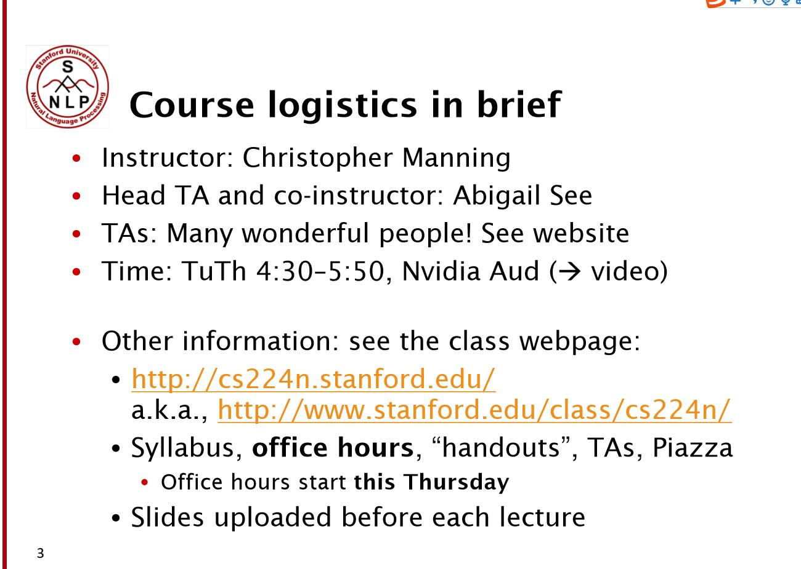
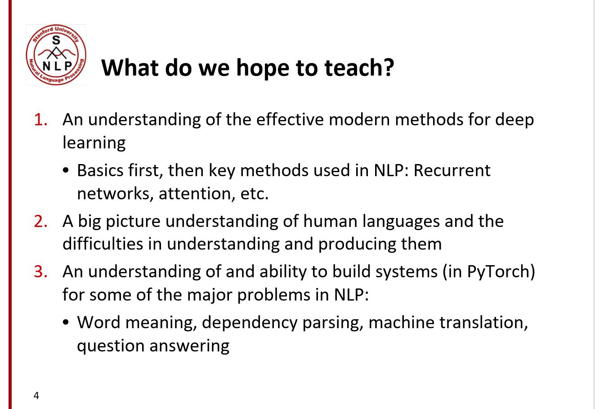
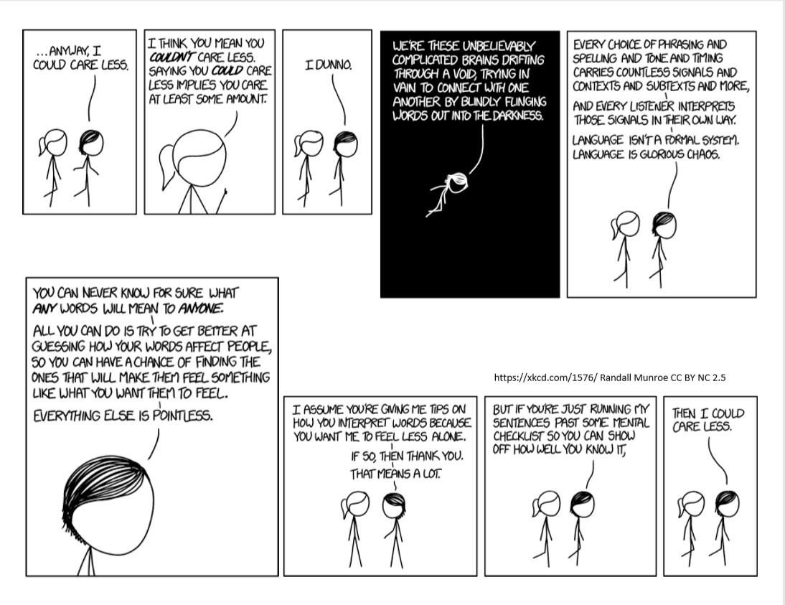
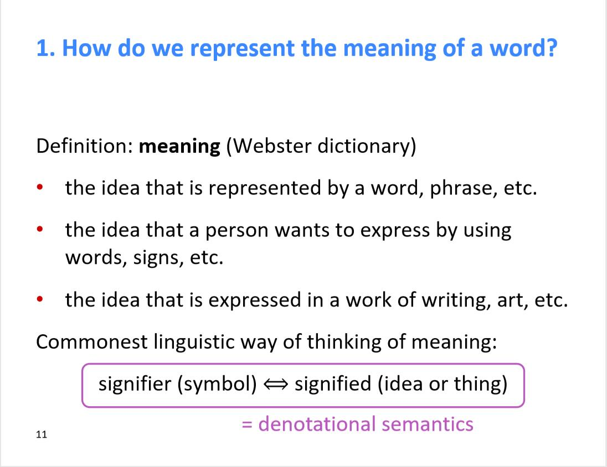
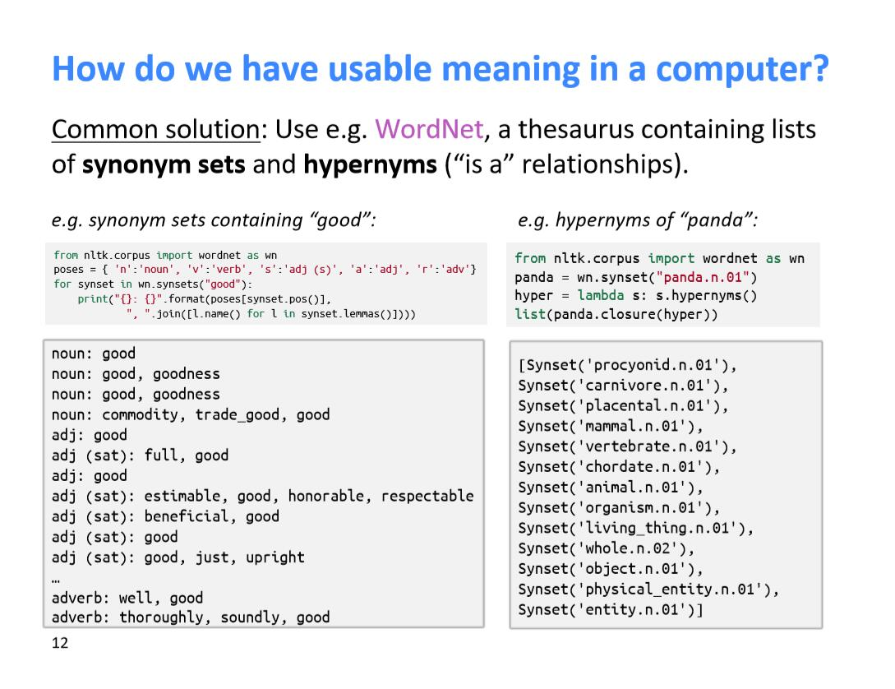
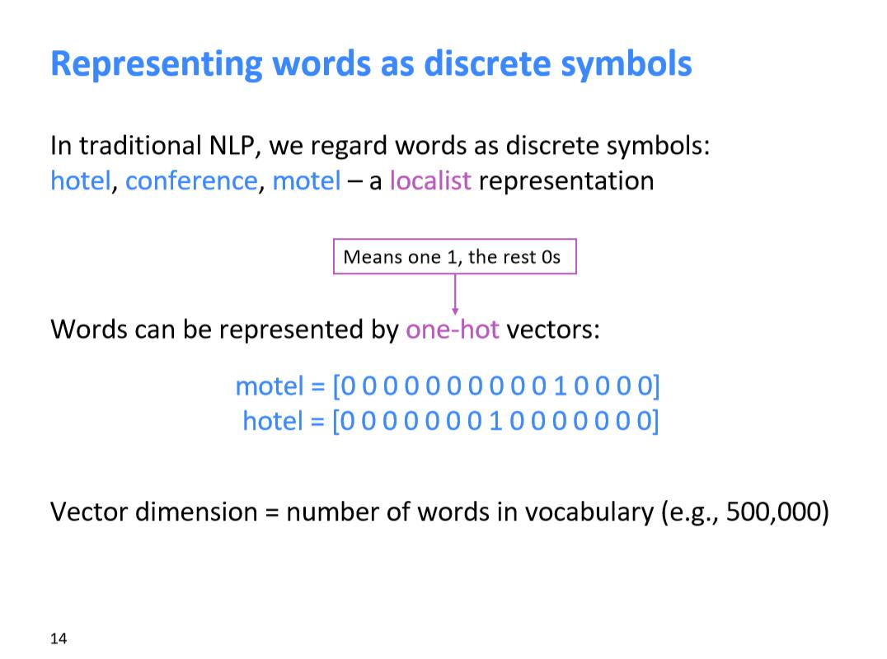
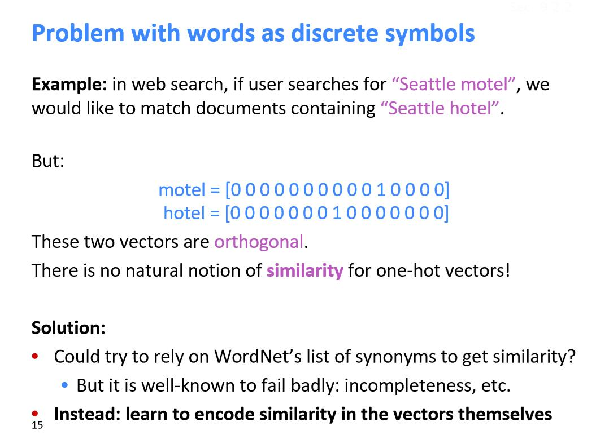
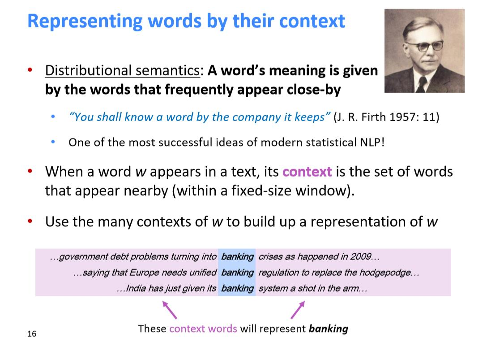

# CS224N-1 Introduction and Word Vectors

在下面的链接中，我们可以找到课程的官网

这节课希望教会我们什么？

我们想教的第一件事就是希望你们能够学会一下有效的深度学习的现代方法

首先会讨论一些基础的NLP技术，然后进一步讨论像RNN，注意力机制等在NLP模型中常用的方法

然后我们会探讨对自然语言的理解，还有理解与生成自然语言的困难

我们这次用的是PyTorch而不是Tensorflow

我们将花费很多时间讨论人类的语言，首先就是XKCD卡通，下面这幅图主要是想告诉人们，人们的语言是多么的不同的环境不同的意义

人们的语言就像一个很慢的神经网络，信息在人类语言间的传递很慢。

虽然我只给你传递了一句话的信息，因为你有知识，你那边可以获得有远超过这一句话的信息，我们可以把一句话表示成图像。

这门课中我们并不是选哪个解决整个语言，我们只是想代表word的意思

我们可以用wordNet来获得语义信息,但是也有它的问题

首先就是我们不能获取同义词间的细微差别

然后就是wordNet从来就是不那么完整，找不到词的新意思，也找不到新词

也不能衡量同义词的相似情况

上面的缺陷导致了人们想用一种更好的方法来表示单词

在这之前说一下2012年之前一直用的传统NLP方法，也就是one-hot方法

问题就是我们的向量空间维度会很大，有多少个词就有多少维度

另一个问题就是不能表征语义信息和关系

所以导出了另一个表示方法，根据上下文表示当前词的向量
