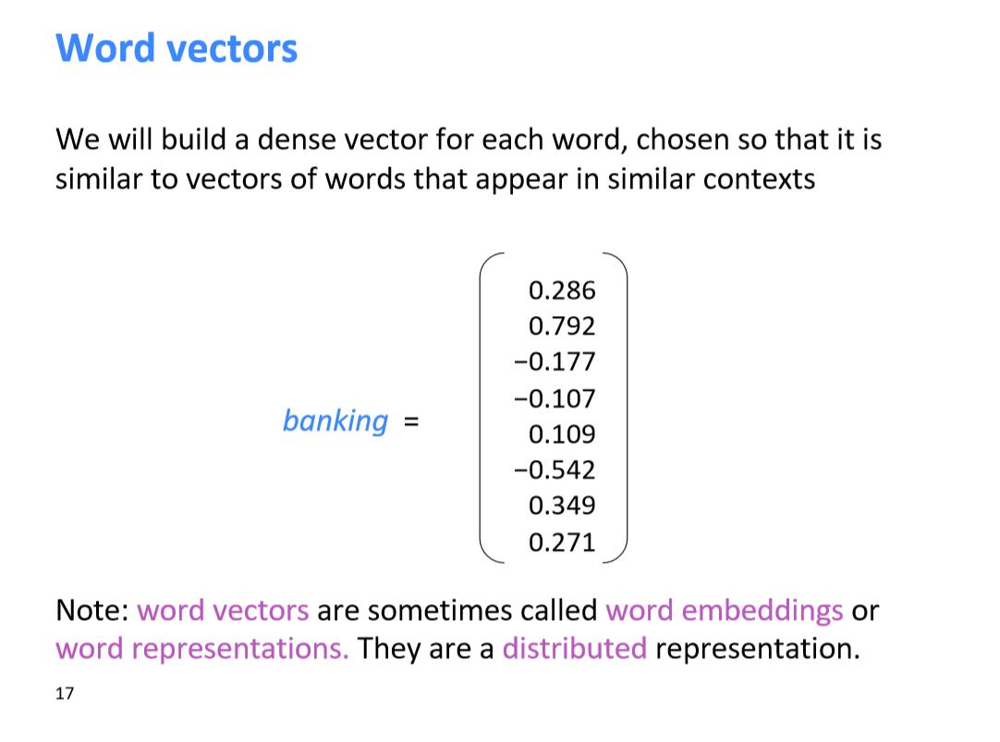
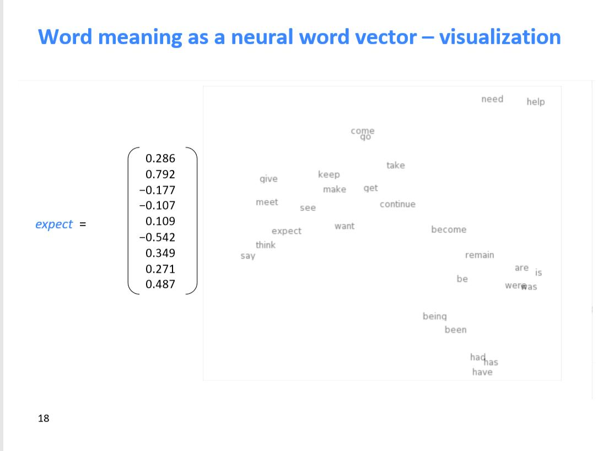
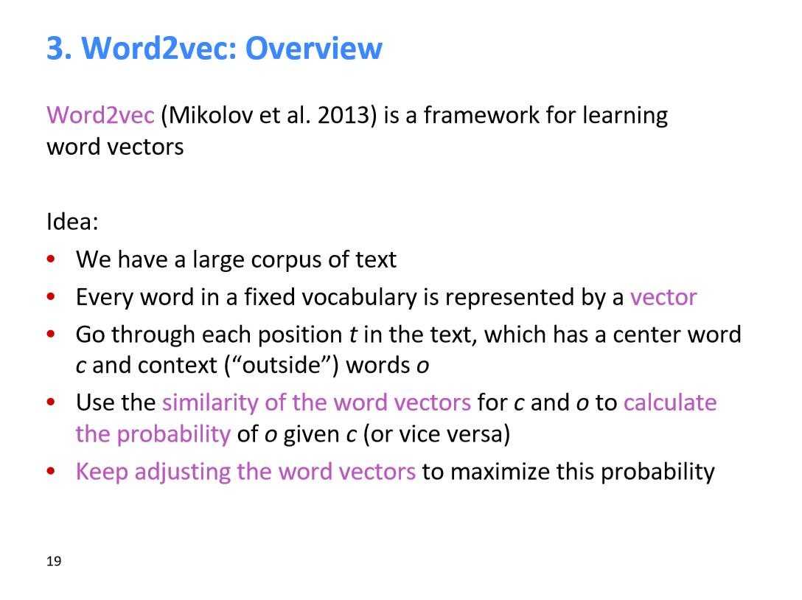
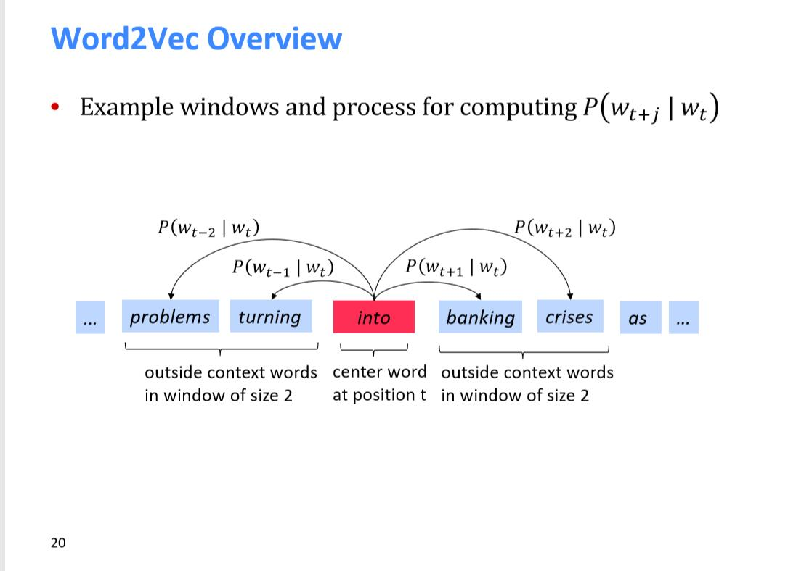
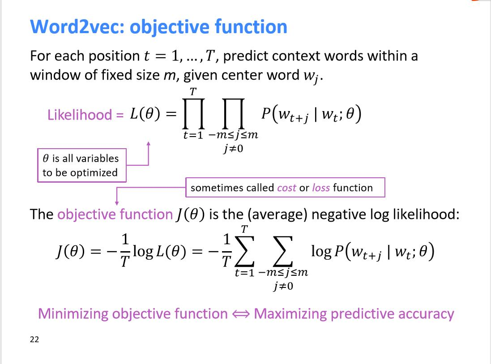
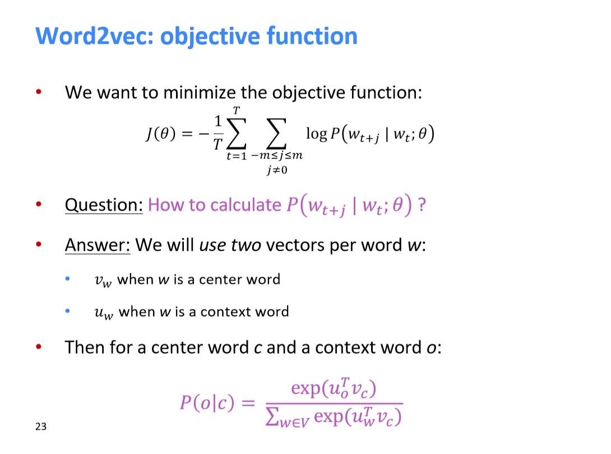
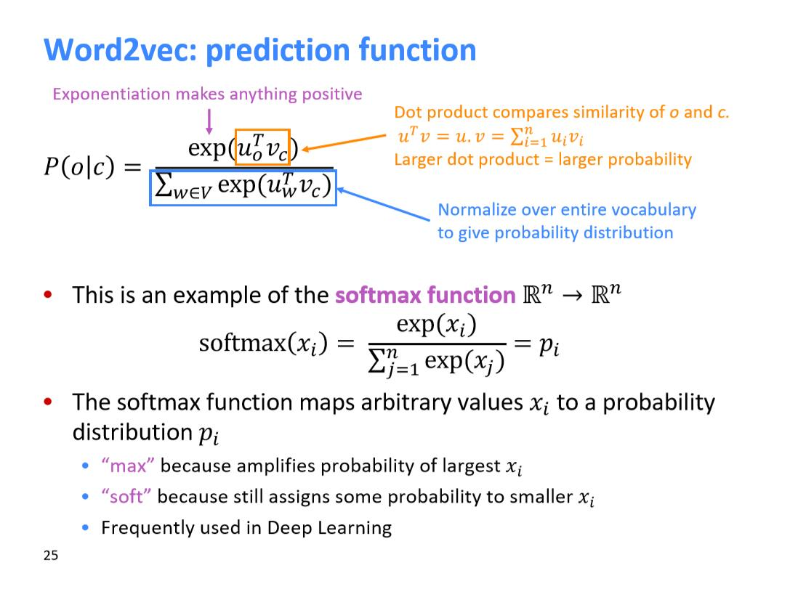
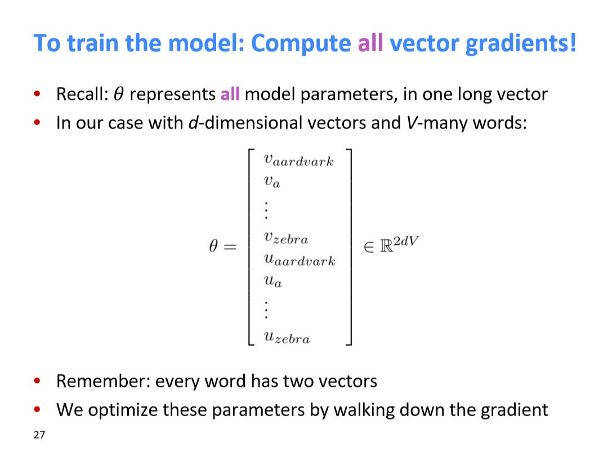
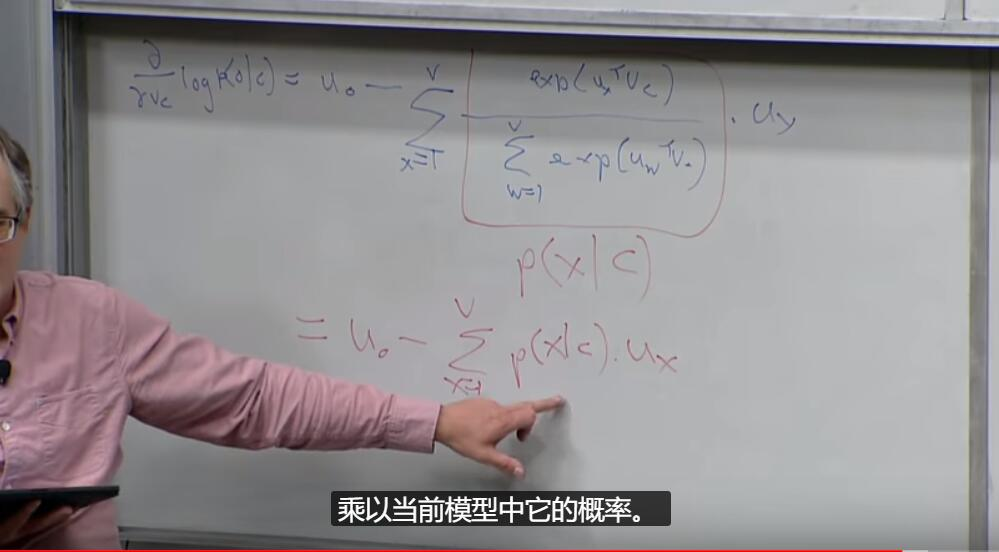

# CS224N-1 Introduction and Word Vectors

在下面的链接中，我们可以找到课程的官网

这节课希望教会我们什么？

我们想教的第一件事就是希望你们能够学会一下有效的深度学习的现代方法

首先会讨论一些基础的NLP技术，然后进一步讨论像RNN，注意力机制等在NLP模型中常用的方法

然后我们会探讨对自然语言的理解，还有理解与生成自然语言的困难

我们这次用的是PyTorch而不是Tensorflow

我们将花费很多时间讨论人类的语言，首先就是XKCD卡通，下面这幅图主要是想告诉人们，人们的语言是多么的不同的环境不同的意义

人们的语言就像一个很慢的神经网络，信息在人类语言间的传递很慢。

虽然我只给你传递了一句话的信息，因为你有知识，你那边可以获得有远超过这一句话的信息，我们可以把一句话表示成图像。

这门课中我们并不是选哪个解决整个语言，我们只是想代表word的意思

我们可以用wordNet来获得语义信息,但是也有它的问题

首先就是我们不能获取同义词间的细微差别

然后就是wordNet从来就是不那么完整，找不到词的新意思，也找不到新词

也不能衡量同义词的相似情况

上面的缺陷导致了人们想用一种更好的方法来表示单词

在这之前说一下2012年之前一直用的传统NLP方法，也就是one-hot方法

问题就是我们的向量空间维度会很大，有多少个词就有多少维度

另一个问题就是不能表征语义信息和关系

所以导出了另一个表示方法，根据上下文表示当前词的向量

比如：我们可以根据很多很多包含“banking”的句子，来表示“bankind”的意思

经过用稠密向量表示后，会比之前用one-hot的方法表示的向量维度小很多

这些词汇是可以表示到向量空间中的，这里是把100维度的向量转化到了2维空间

2013年的这个虽然不是最早的，但是这个让人们用起来了。

首先需要大量的语料

其次就是我们会在一开始给每个单词一个初始化的向量

我们用当前词来预测当前词打的上下文，然后调整这些词的向量表示，让预测的结果更准确

在下面这个模型中，T代表着所有的句子中的每个位置，也就是你的语料的每个句子分词后的长度和。
m代表的是窗口大小
然后1/T代表的是我们要对每个位置取平均，中间还对似然函数加上了log

这个模型的一个特点就是所以的参数就是每个单词的词向量表达，没有其他参数

但是我们怎么计算这个模型呢，我们用的是当前词和上下文的点乘最大，也就是经过softmax后最大

记住每个单词有两个向量，一个是这个单词的表示，另一个是这个单词在上下文中的表示

我们模型优化的方向，就是当前上下文与模型认为的上下文之差，如果模型认为的上下文与实际的上下文
有偏差，这就是我们要优化的东西，比如实际的上下文是[1，2,3]，模型认为的是[0,2,3],此时偏差为[1,0,0]
也就是说在第二个维度和第三个维度已经不需要优化了，只需要优化第一个维度就可以了
